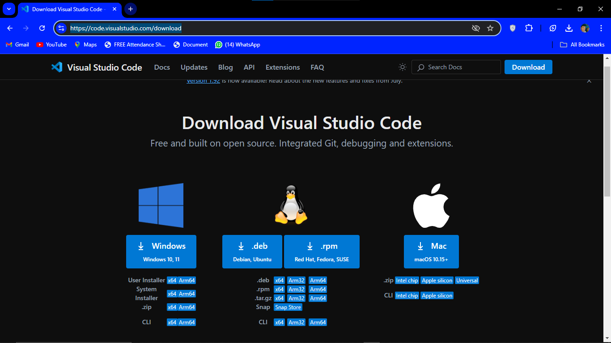
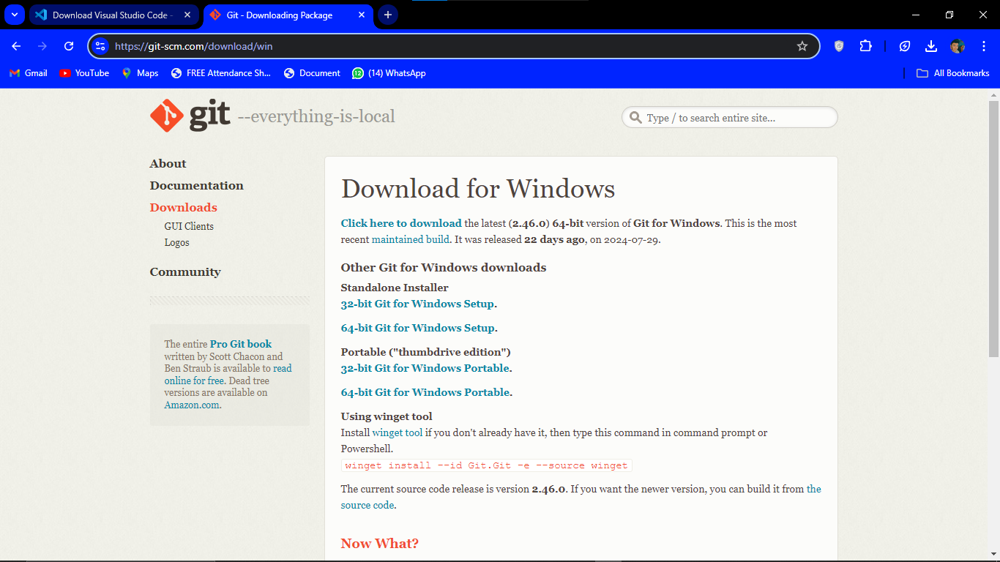

# Code with Nehal.
1. ##   Install `VScode`
1. Go to => https://code.visualstudio.com/download

1. Install for your operating system etc: for window , for linux , for macos users.
1. ## Then Install `Git`
1. Go to => https://git-scm.com/download/win

1. click on `64-bit Git for Windows Setup` for download in windows.
1. After installation open command prompt and run these commands.
`git config --global user.name "your name"`
`git config --global user.email "youremail"`
1. This commands run only one time after install Git.